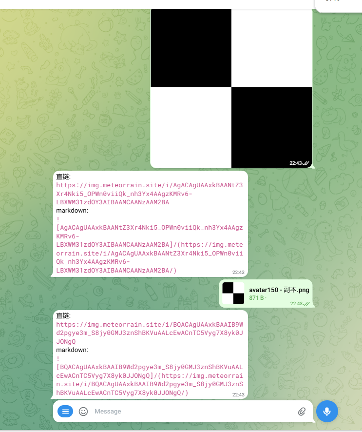
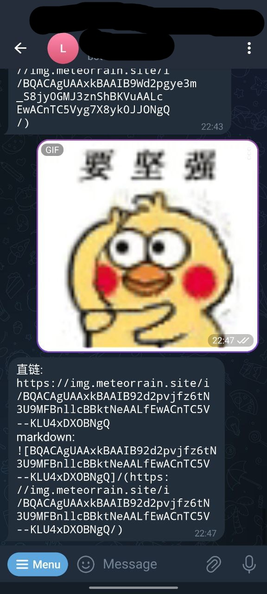

# tgimg
使用 telegram bot 搭建的图床

该项目从 https://github.com/beilunyang/img-mom 产生 , 去除了 oss 的设置 , 也不需要 kv 和 d2 存储 , 主打的就是一个简陋 , 代码很大部分来源于 img-mom , 再次表示感谢 .

项目工具栈 :

typescript , grammy , hono

项目原理 :

用户在 tg 客户端上传图片给 bot , 搭建在 cloudflare workers 上面的 hono 以 webhooks 的方式运行 tg bot api , 读取文件并返回链接 , 链接的主要内容是文件的 file_id . hono 的 get 路由读取到 file_id , cloudflare workers 作为中介返回文件 .

项目特点 :

足够简陋 , 容易部署

未来开发走向 :

网页端上传 , 图片备份

效果图 :

部署方式 :

cloudflare :

clone 该项目 , 运行 npm install , 复制 src/config.example.json 到 config.json , 在 config.json 里面填上自己的域名 , url 前缀 , 运行 npm run deploy .
